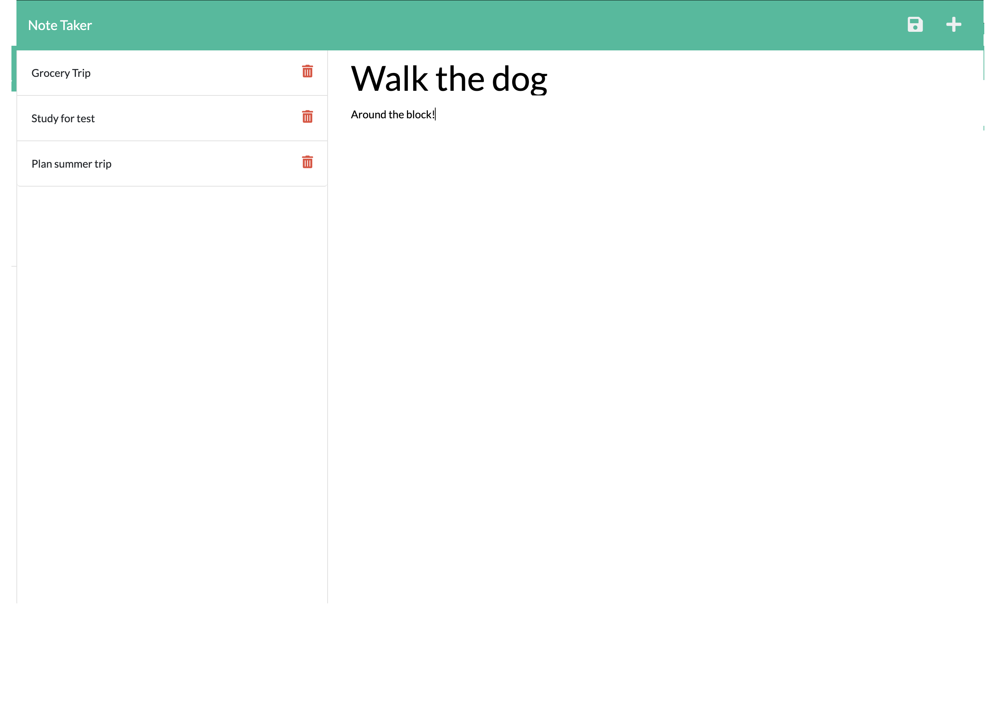

# Note Taker App


## Table of Contents
1. [Project Intro](#project-intro)
2. [Project Outline](#project-outline)
3. [Dependencies](#dependencies)
4. [Usage](#usage)
5. [Contributing](#contributing)
6. [Testing](#testing)
7. [Reporting Errors](#reporting-errors)
8. [License](#license)
9. [Questions](#questions)

## Project Intro
When you want to jot something down for later but don't have anything to write with.

## Project Outline
```
This application utilizes Express servers to help create a dynamic application that can call GET, POST and DELETE routes and save user inputted data in a json file.
```

## Dependencies
The application uses the following dependencies: 
EXPRESS 4.16.4
UUID 9.0.0
> **Note**: To install these modules the command is 'npm install'.

## Usage
The start the app, press the 'Get Started' Button. You will be taken to a page that has a section for creating a new note. When you have entered a new note, you can save it by pressing the save icon in the top right corner. This will save the title of the note in the column to the left. When you want to view a saved note, you can click on it and it will display in the right column. If you then want to make a new note, press the '+' in the upper right corner. To DELETE a note, press the red trash-can icon next to the note.



## Contributing
The application is open for developers to add functionality and design. 

## Testing
There are currently no tests for the application.

## Reporting Errors
Please report all errors to andy.kleindienst@gmail.com.

## License
The application is covered under the MIT License.

## Questions
For any questions regarding the project, please send correspondence to andy.kleindienst@gmail.com.


